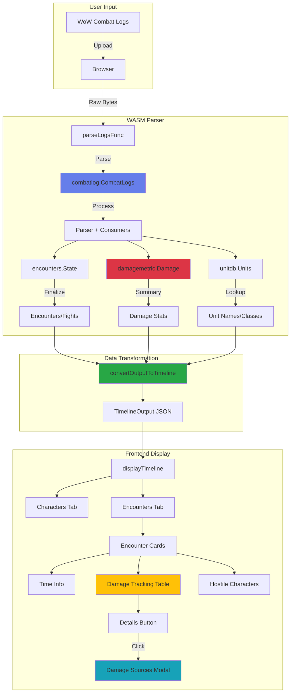

# WASM Damage Tracking Architecture

## Data Flow Diagram



## Component Breakdown

### 1. WASM Layer (Go)
- **Input**: Raw combat log bytes
- **Processing**: 
  - Line scanning & merging
  - Event parsing
  - Consumer aggregation (encounters, damage, units)
- **Output**: JSON with structured data

### 2. Data Structures

```
TimelineOutput
├── Instances[]
    ├── InstanceData
        ├── Characters[] (CharacterData)
        │   ├── Name, Class, IsPlayer
        │   └── Activity Periods[]
        └── Encounters[] (EncounterData)
            ├── Name, Type, Duration, IsKill
            ├── Hostiles[] (HostileData)
            │   └── Activity Periods[]
            └── Damage (DamageData)
                └── TotalDealt{} (map[GUID]UnitDamage)
                    ├── UnitName, Class, IsPlayer
                    ├── Total, DPS
                    └── Sources{} (map[spell]damage)
```

### 3. Frontend Layer (JavaScript)

#### Display Components
1. **Instance Cards**: Container for each instance
2. **Encounter Cards**: Individual fights with:
   - Time information
   - Kill/Wipe status
   - Encounter type (Boss/Trash)
   - **Damage Tracking Table**: Main feature
   - Hostile character list

#### Interactive Elements
- **Damage Table**: Sortable, shows rank, name, class, total, DPS
- **Details Button**: Opens modal with damage source breakdown
- **Modal Dialog**: Shows sources with percentages and progress bars

## Key Features

### Damage Tracking
- ✅ Per-encounter damage statistics
- ✅ DPS calculation
- ✅ Source breakdown (spells/abilities)
- ✅ Player vs NPC distinction
- ✅ Class identification with color coding

### UI/UX
- ✅ Responsive design
- ✅ Interactive hover effects
- ✅ Modal popups for details
- ✅ Progress bars for visual comparison
- ✅ WoW-themed class colors
- ✅ Number formatting with commas

## Performance Considerations

1. **WASM Size**: 5.0MB (acceptable for browser)
2. **JSON Parsing**: Done once on upload
3. **DOM Updates**: Efficient, only builds visible elements
4. **Memory**: Modal overlay created/destroyed on demand

## Browser Compatibility

- Modern browsers with WASM support
- Tested features:
  - WebAssembly instantiation
  - FileReader API
  - ES6+ JavaScript
  - Flexbox/Grid layouts
  - CSS transforms and transitions
