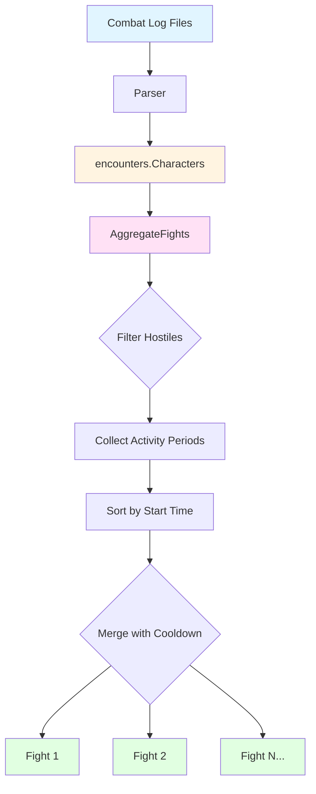
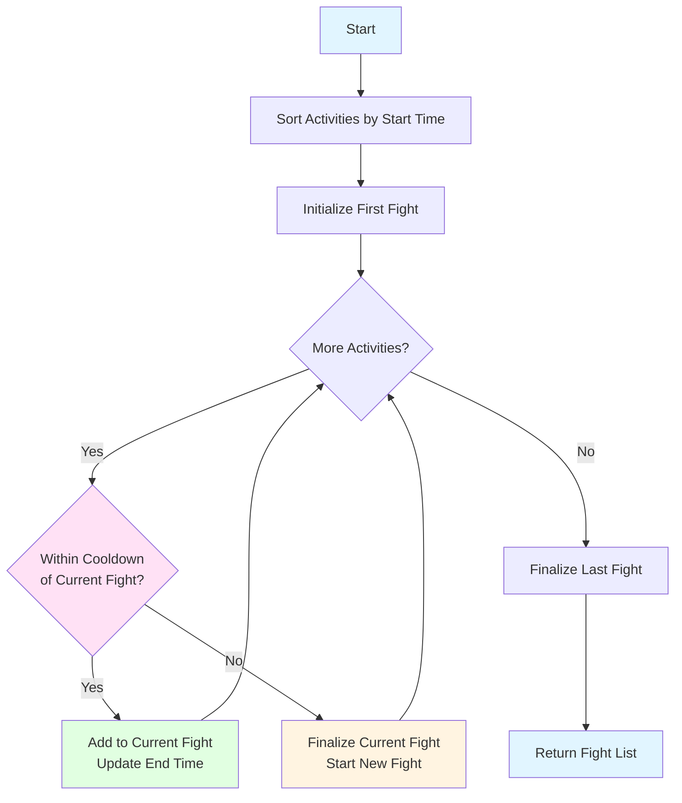
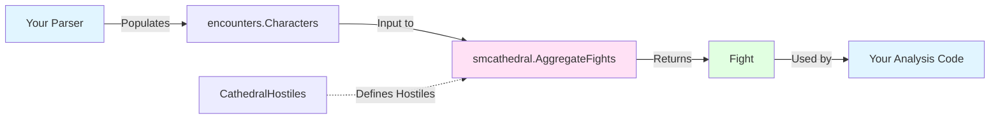

# Fight Aggregator Architecture

## System Flow



## Data Structure Relationships

```mermaid
graph LR
    A[encounters.Characters<br/>map GUID → *Character] --> B[AggregateFights]
    B --> C[Fight]
    C --> D1[CharacterFight 1]
    C --> D2[CharacterFight 2]
    C --> DN[CharacterFight N]
    D1 --> E1[Active Period 1]
    D1 --> E2[Active Period 2]
    D2 --> E3[Active Period 3]
    
    C -.Start: time.Time.-> C
    C -.End: time.Time.-> C
    
    style A fill:#e1f5ff
    style B fill:#ffe1f5
    style C fill:#e1ffe1
    style D1 fill:#fff4e1
    style D2 fill:#fff4e1
    style DN fill:#fff4e1
```

## Merging Algorithm



## Timeline View

```
Input: Character Activity Periods
┌─────────────────────────────────────────────────────────────────┐
│ Monk      [████████]                                             │
│ Chaplain          [█████████████]                                │
│ Fighter                                      [████████████]      │
│ Wizard                                          [██████████████] │
└─────────────────────────────────────────────────────────────────┘
  0s       30s      60s      90s     120s     150s     180s    240s
                                      
                    ▼ AggregateFights() ▼
                    
Output: Grouped Fights
┌─────────────────────────────────────────────────────────────────┐
│ Fight 1: 0s-60s                                                  │
│   ├─ Monk: [0-30s]                                              │
│   └─ Chaplain: [30-60s]                                         │
│                                                                  │
│ Fight 2: 120s-240s                                              │
│   ├─ Fighter: [120-180s]                                        │
│   └─ Wizard: [150-240s]                                         │
└─────────────────────────────────────────────────────────────────┘
```

## Key Components

### 1. Input Processing
- **Source**: `encounters.Characters` populated during log parsing
- **Filter**: Only hostiles from `CathedralHostiles()`
- **Requirement**: Activity periods must be complete (have End time)

### 2. Aggregation Logic
- **Sort**: By activity start time (ascending)
- **Cooldown**: Default 60s, customizable
- **Merge**: Activities within cooldown window → same fight
- **Track**: Earliest start, latest end per fight

### 3. Output Structure
- **Fight**: Container for entire encounter
- **CharacterFight**: Per-hostile activity tracking
- **Active**: Original activity periods preserved

## Integration Points



