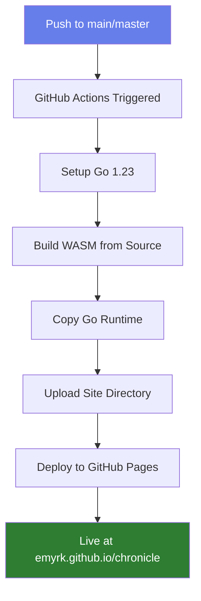

# 🚀 Quick Start: Deploy to GitHub Pages

## TL;DR

1. Go to **Settings** → **Pages** in your GitHub repo
2. Set **Source** to **GitHub Actions**
3. Push this branch to GitHub
4. Wait 1-2 minutes
5. Visit `https://emyrk.github.io/chronicle/` 🎉

## What Happens Automatically



## One-Time Setup

### Step 1: Enable GitHub Pages

In your repository on GitHub:

1. Click **Settings** (top menu)
2. Click **Pages** (left sidebar)
3. Under "Build and deployment":
   - **Source:** Select `GitHub Actions` from dropdown
4. Click **Save** (if needed)

That's it! 🎊

### Step 2: Push This Code

```bash
# If you're on a branch other than main/master
git checkout main  # or master

# Commit the new files
git add .
git commit -m "Add WASM web interface with GitHub Pages deployment"
git push origin main
```

### Step 3: Watch the Magic

1. Go to the **Actions** tab in GitHub
2. You'll see "Deploy to GitHub Pages" workflow running
3. Wait for the green checkmark ✅ (about 1-2 minutes)
4. Your site is live!

## Accessing Your Site

### URL Format

```
https://<username>.github.io/<repository>/
```

### For This Repo

```
https://emyrk.github.io/chronicle/
```

## Manual Deployment Trigger

You can manually trigger a deployment:

1. Go to **Actions** tab
2. Select "Deploy to GitHub Pages"
3. Click **Run workflow** button
4. Choose branch and click **Run workflow**

## What Gets Deployed

The workflow deploys everything in the `site/` directory:

- ✅ `index.html` - The main web page
- ✅ `app.js` - JavaScript application
- ✅ `parser.wasm` - Built fresh from Go source
- ✅ `wasm_exec.js` - Go WebAssembly runtime
- ✅ `.nojekyll` - Prevents Jekyll processing
- ✅ `README.md` - Documentation

## Automatic Updates

The workflow runs automatically when:

- ✅ You push to `main` or `master` branch
- ✅ Changes are in `golang/**` or `site/**`
- ✅ You modify the workflow file itself

No manual WASM building needed - just push your Go code changes!

## Verification Checklist

After deployment, verify:

- [ ] GitHub Actions workflow completed successfully (green checkmark)
- [ ] Site loads at your GitHub Pages URL
- [ ] File upload buttons appear
- [ ] WASM module loads (check browser console)
- [ ] You can upload and parse log files
- [ ] Results display as JSON

## Troubleshooting

### ❌ Workflow Fails

**Check the Actions tab:**
- Click on the failed workflow
- Expand the failed step
- Read the error message

**Common issues:**
- Go version mismatch → Update workflow file
- Missing dependencies → Check `go.mod`
- Build errors → Test locally first

### ❌ Site Doesn't Load

**404 Not Found:**
- Wait a few minutes after first deployment
- Check if Actions workflow succeeded
- Verify Pages source is set to "GitHub Actions"

**Blank Page:**
- Open browser console (F12)
- Look for JavaScript errors
- Check if all files loaded (Network tab)

### ❌ WASM Doesn't Work

**Check browser console:**
```javascript
// Should see:
WASM Go parser initialized
```

**If not:**
- Verify `parser.wasm` loads (Network tab)
- Check for MIME type issues
- Try a different browser

## Advanced Options

### Custom Domain

1. Add `CNAME` file to `site/`:
   ```bash
   echo "your-domain.com" > site/CNAME
   git add site/CNAME
   git commit -m "Add custom domain"
   git push
   ```

2. Configure your DNS provider
3. Enable HTTPS in GitHub Pages settings

### Private Repository

GitHub Pages works on private repos with:
- GitHub Pro, Team, or Enterprise
- Same setup process
- Site is still public!

## Cost

**Free!** 🎉

- GitHub Pages is free for public repos
- 100 GB bandwidth/month soft limit
- 1 GB storage limit (you're using ~4.2MB)

## Security

- ✅ Served over HTTPS automatically
- ✅ All processing happens client-side
- ✅ No data leaves the user's browser
- ✅ No backend server needed

## Need Help?

See the detailed deployment guide: [DEPLOYMENT.md](./DEPLOYMENT.md)

Or check these resources:
- [GitHub Pages Docs](https://docs.github.com/pages)
- [GitHub Actions Docs](https://docs.github.com/actions)
- [Go WebAssembly Wiki](https://github.com/golang/go/wiki/WebAssembly)
