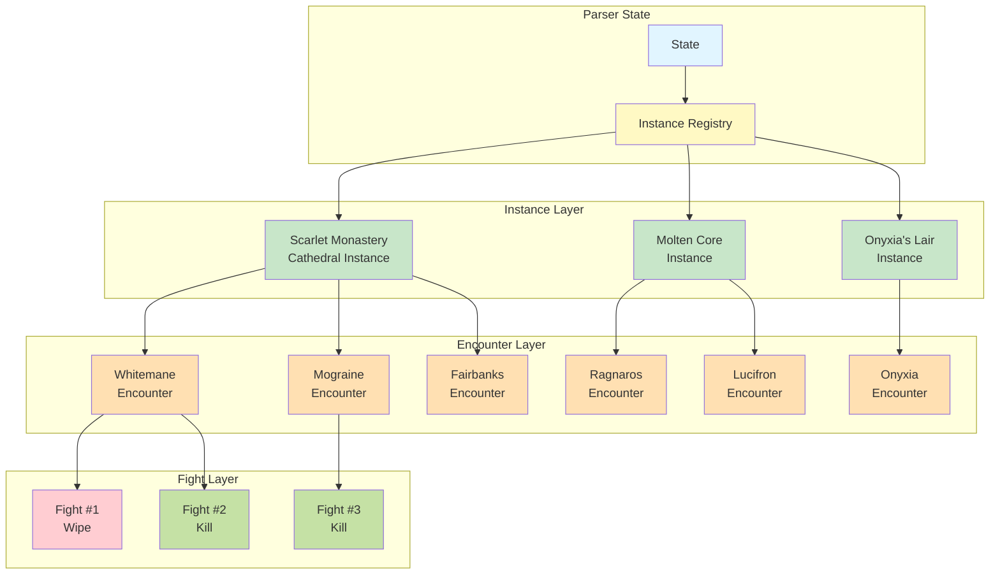
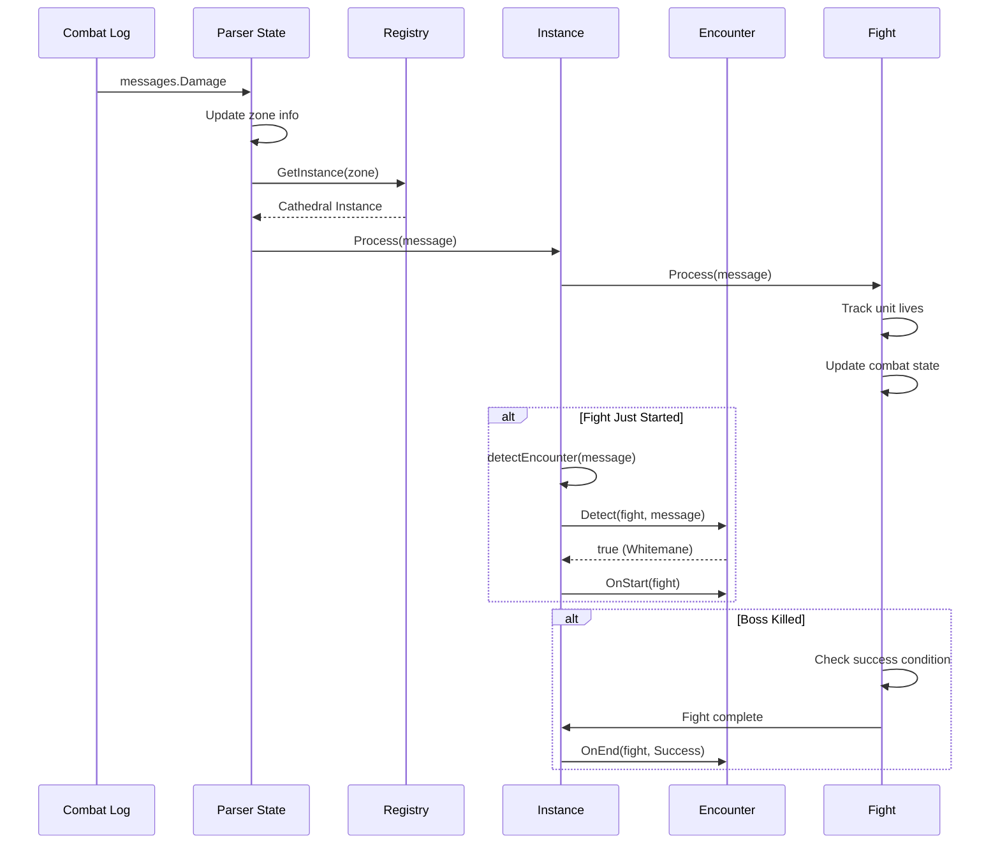
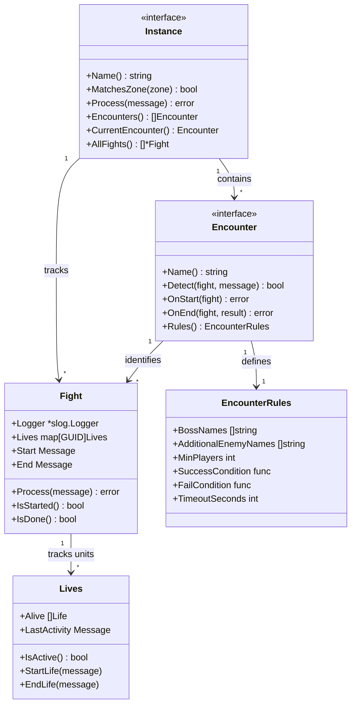

# System Structure Diagram

## Component Hierarchy



## Data Flow



## Class Diagram



## Directory Structure

```
state/encounters/
│
├── Core Interfaces & Types
│   ├── instance.go          # Instance interface & BaseInstance
│   ├── encounter.go         # Encounter interface & BaseEncounter
│   ├── fight.go            # Fight tracking logic
│   ├── life.go             # Unit life/death tracking
│   └── registry.go         # Instance factory registry
│
├── Documentation
│   ├── README.md           # Usage guide
│   ├── DESIGN.md           # Architecture details
│   └── STRUCTURE.md        # This file
│
└── Concrete Instances
    └── instances/
        ├── smcathedral/         # Scarlet Monastery Cathedral
        │   ├── instance.go      # Cathedral instance implementation
        │   ├── encounters.go    # Encounter definitions
        │   └── whitemane.go     # Complex encounter example
        │
        ├── moltencore/          # Molten Core (future)
        │   ├── instance.go
        │   ├── encounters.go
        │   ├── ragnaros.go
        │   └── lucifron.go
        │
        └── onyxia/             # Onyxia's Lair (future)
            ├── instance.go
            └── encounters.go
```

## Key Design Patterns

### 1. Strategy Pattern
- Different instances implement the `Instance` interface
- Different encounters implement the `Encounter` interface
- Allows pluggable behavior without modifying core code

### 2. Factory Pattern
- Registry creates instances based on zone
- Instance factories are registered at startup
- Loose coupling between parser and instances

### 3. Template Method Pattern
- `BaseEncounter` provides default behavior
- Specific encounters override only what they need
- Reduces boilerplate code

### 4. Observer Pattern
- Instances observe combat log messages
- Encounters react to fight state changes
- Hooks: `OnStart()`, `OnEnd()`

## Adding a New Instance

1. Create package: `instances/myinstance/`
2. Implement `Instance` interface
3. Define encounters with `EncounterRules`
4. Register in `registry.go`
5. Done! The system automatically routes messages

## Example: Processing Flow

```
1. Combat log message arrives
   ↓
2. State.Process() receives message
   ↓
3. Check current zone
   ↓
4. Registry.GetInstance(zone)
   ↓
5. Instance.Process(message)
   ↓
6. Fights.Process(message)
   ↓
7. Fight.Process(message)
   ↓
8. Update unit lives, damage, etc.
   ↓
9. Check if fight should start/end
   ↓
10. If starting: Detect which encounter
    ↓
11. Call encounter.OnStart()
    ↓
12. If ending: Call encounter.OnEnd()
```
