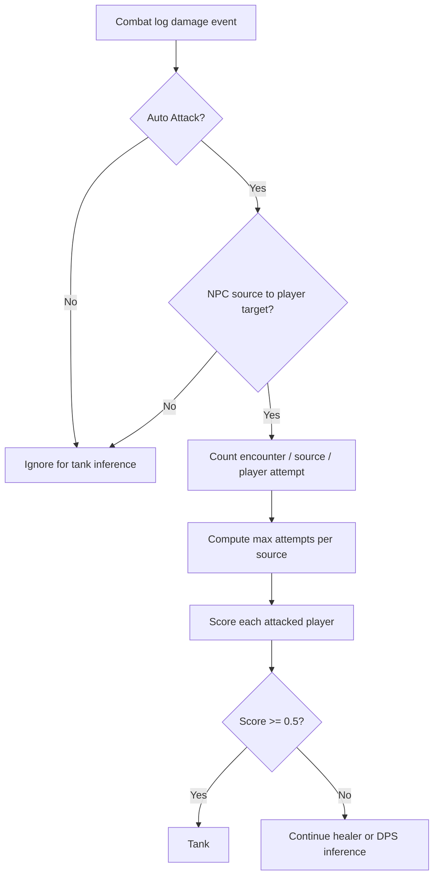
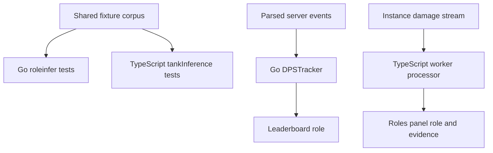

# Tank role inference

Chronicle infers encounter tank roles from incoming hostile Auto Attack attempts.
The algorithm intentionally does not use class, specialization, talents, stance,
form, or total damage taken.

## Goals

- Use one global threshold in Go and TypeScript.
- Ignore raid-wide spell damage by construction.
- Detect main tanks and tanks assigned to separate hostile sources.
- Count avoided and zero-damage attacks as evidence.
- Keep leaderboard parsing and the interactive Roles panel behavior identical.
- Preserve enough evidence in the Roles panel to debug real instances.

## Packages

| Runtime | Package | Responsibility |
|---|---|---|
| Go | `internal/roleinfer` | Pure scoring and classification used by leaderboard parsing |
| TypeScript | `EventsPanels/Roles/tankInference.ts` | Matching pure scoring and classification |
| Go parser | `rankings.DPSTracker` | Extract source/player Auto Attack attempt counts before damage filtering |
| TypeScript worker | `Roles/tankAttempts.processor.ts` | Extract matching counts from the damage event stream |
| Shared tests | `testdata/roleinfer/cases.json` | Language-neutral parity cases loaded by Go and TypeScript tests |

Both packages expose these versioned constants:

```text
AlgorithmVersion = 1
TankThreshold = 0.5
EvidenceAttempts = 5
```

`TankThreshold` is the single global classification threshold.
`EvidenceAttempts` is a fixed smoothing term in the versioned formula, not an
encounter-specific cutoff.

## Algorithm

For each encounter and hostile source:

1. Count Auto Attack attempts directed at each player.
2. Include hits, crits, blocks, misses, dodges, parries, absorbs, and other
   zero-damage outcomes when represented as Auto Attacks.
3. Find the largest player attempt count for that source.
4. Score every attacked player:

```text
sourceScore = playerAttempts / (maxAttempts + EvidenceAttempts)
```

A player's tank score is their maximum source score. The player is a tank when:

```text
tankScore >= TankThreshold
```

The Roles panel evaluates each selected encounter independently and retains the
best evidence. Boss leaderboard rows are already encounter-specific. Trash
ranking rows merge their source counts across included trash encounters.

### Example

A boss attacks one player 20 times and another player twice:

```text
tank = 20 / (20 + 5) = 0.80  -> tank
dps  =  2 / (20 + 5) = 0.08  -> not tank
```

Five attempts from the primary target sit exactly on the global threshold:

```text
5 / (5 + 5) = 0.50 -> tank
```

Fewer than five attempts cannot cross the threshold in algorithm version 1.

## Data flow





## Auto Attack identification

Go accepts messages whose spell data identifies spell ID `6603`. It also has a
fallback for legacy swing messages without spell data.

TypeScript accepts damage events when either:

- `spellId === 6603`, or
- `sourceName === "Auto Attack"`.

The source must not be a player or player-owned unit. The target must be a
player. Generic physical spell damage, Cleave, and raid-wide AoE do not enter
the tank scorer.

## Roles panel debugging

Open the Roles panel and expand **Detection thresholds**, then **Tank evidence**.
The table is sorted by score and shows:

- Player
- Tank score
- Strongest hostile source
- Player attempts versus that source's maximum
- Final tank classification

For several selected encounters, the table shows each player's strongest
source/encounter result.

## Fetching real instances

Use `scripts/fetch-fixtures/fetch-fixtures.sh` to fetch instance metadata and
binary event streams by slug or full Chronicle URL. Fetched data is written to
a gitignored directory.

```bash
./scripts/fetch-fixtures/fetch-fixtures.sh INSTANCE_SLUG
./scripts/fetch-fixtures/fetch-fixtures.sh -f instance-slugs.txt
./scripts/fetch-fixtures/fetch-fixtures.sh -b http://localhost:4000 INSTANCE_SLUG
```

See `scripts/fetch-fixtures/README.md` for all options and the local data layout.
The same slug can be opened in the site to inspect the Roles evidence table:

```text
/instances/{slug}?panels=roles
```

The fetch tool is intended for exploratory analysis. Promote only small,
purpose-built cases into `testdata/roleinfer/cases.json`. Never commit fetched
live instance data, which may contain player names and combat details.

## Changing the algorithm

Any formula, threshold, smoothing, aggregation, or event-identification change
must:

1. Increment `AlgorithmVersion` in both packages.
2. Update the constants in both packages.
3. Update the shared fixture corpus.
4. Pass Go and TypeScript parity tests.
5. Be validated against representative live instances before reparsing or
   changing historical leaderboard data.

## Known limitations

- Caster enemies that never perform Auto Attacks may provide no tank evidence.
- Five isolated attacks can cross the current threshold if no other player took
  more attacks from that source. Real-data validation will determine whether a
  timing feature is needed in a later algorithm version.
- The generic scorer treats every hostile source independently. This is useful
  for add tanks, but weak trash mobs can create evidence if they attack one
  player often enough.
- The threshold is an initial global value. It is now visible and testable, but
  should be calibrated with labeled real instances before broad historical
  reparsing.
