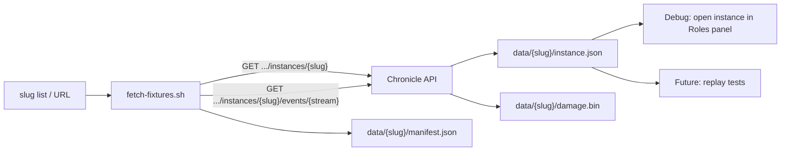

# fetch-fixtures — Live Instance Data Fetcher

Pull real Chronicle instance data on demand for local debugging and algorithm
development (e.g. tank-role inference). Fetched data is **never committed** —
the output directory is gitignored.

## Quick start

```bash
# Fetch a single instance (damage stream by default)
./scripts/fetch-fixtures/fetch-fixtures.sh OKry7FkxJjc2Yzgf

# Fetch from a full Chronicle URL
./scripts/fetch-fixtures/fetch-fixtures.sh https://chronicle.gg/instances/OKry7FkxJjc2Yzgf

# Fetch multiple streams
./scripts/fetch-fixtures/fetch-fixtures.sh -s damage,heal,cast OKry7FkxJjc2Yzgf

# Read slugs from a file
./scripts/fetch-fixtures/fetch-fixtures.sh -f my-slugs.txt

# Use a different base URL (staging, local dev)
./scripts/fetch-fixtures/fetch-fixtures.sh -b http://localhost:4000 OKry7FkxJjc2Yzgf
```

## Options

| Flag | Default | Description |
|------|---------|-------------|
| `-b, --base-url` | `https://chronicle.gg` | Chronicle API base URL |
| `-f, --file` | — | Read slugs/URLs from a file (one per line, `#` comments) |
| `-o, --out-dir` | `scripts/fetch-fixtures/data` | Output directory |
| `-s, --streams` | `damage` | Comma-separated event streams to fetch |
| `-h, --help` | — | Show help |

Available streams: `damage`, `heal`, `cast`, `aura`, `slain`, `resource_change`, `extra_attack`.

## Directory layout

```
scripts/fetch-fixtures/
├── fetch-fixtures.sh          # CLI tool
├── fetch-fixtures_test.sh     # Unit tests (no network)
├── README.md                  # This file
└── data/                      # ← gitignored, created on first fetch
    └── OKry7FkxJjc2Yzgf/
        ├── instance.json      # GET /api/v1/raidlogs/instances/{slug}
        ├── damage.bin          # GET /api/v1/raidlogs/instances/{slug}/events/damage
        └── manifest.json      # Source URL, slug, streams, fetch timestamp
```

## Data flow



## How to use fetched data

### Live debugging (now)

After fetching, open the instance in your browser to inspect the Roles panel:

```
https://chronicle.gg/instances/{slug}?panels=roles
```

Compare the panel output against the raw `instance.json` and `damage.bin`
data to verify role inference behaviour for specific encounters.

### Replay tests (future)

Fetched fixtures can serve as golden-file inputs for processor unit tests.
Copy a fixture into `EventsPanels/__fixtures__/` (which _is_ committed) to
create a permanent regression test, or load directly from `data/` for
exploratory testing during development.

## Slug normalization

The tool accepts any of these input formats and extracts the slug
automatically:

- Bare slug: `OKry7FkxJjc2Yzgf`
- Instance page URL: `https://chronicle.gg/instances/OKry7FkxJjc2Yzgf`
- API URL: `https://chronicle.gg/api/v1/raidlogs/instances/OKry7FkxJjc2Yzgf`
- API URL with path suffix: `.../instances/OKry7FkxJjc2Yzgf/events/damage`
- Relative API path: `/api/v1/raidlogs/instances/OKry7FkxJjc2Yzgf`

Slugs must be 4–64 characters, alphanumeric plus hyphens and underscores.

## Running tests

```bash
bash scripts/fetch-fixtures/fetch-fixtures_test.sh
```

Tests cover slug normalization and validation without any network calls.

## Privacy and caching notes

- **Never commit fetched data.** The `data/` directory is gitignored.
  Instance data may contain player names and combat details.
- **Re-fetch is idempotent.** Running the tool again overwrites existing
  files for the same slug (atomic write via temp file + mv).
- **No local cache expiry.** Delete a slug directory to force a fresh fetch.
- **Rate limiting.** The tool makes one HTTP request per file. Be mindful
  when fetching many instances at once.
